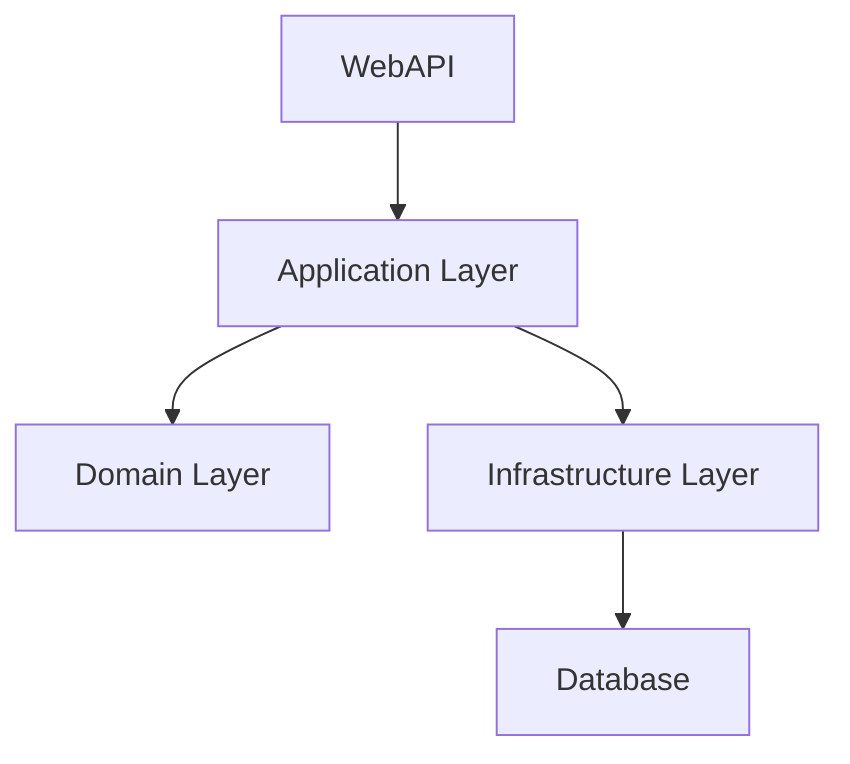

# Instituto Virtus 🎓

## Sistema de Gestão Acadêmica para Música e Teologia

> Plataforma completa e moderna para gestão de cursos de música e teologia, desenvolvida com as melhores práticas de desenvolvimento.

<div align="center">


</div>

---

## 📖 Sobre o Projeto

O **Instituto Virtus** é uma solução completa de gestão acadêmica desenvolvida especificamente para instituições de ensino de música e teologia. Nossa plataforma oferece um controle abrangente e intuitivo sobre todos os aspectos administrativos e pedagógicos da instituição.

### 🎯 Objetivo

Modernizar e automatizar os processos administrativos de instituições de ensino especializadas, proporcionando uma experiência fluida tanto para administradores quanto para alunos.

### ✨ Principais Funcionalidades

<table>
<tr>
<td width="50%">

#### 👥 **Gestão de Alunos**

- Cadastro completo com documentação
- Histórico acadêmico detalhado
- Controle de frequência
- Perfil personalizado por aluno

#### 🎓 **Gestão de Turmas**

- Criação e organização de classes
- Controle de capacidade e horários
- Alocação automática de professores
- Calendário acadêmico integrado

</td>
<td width="50%">

#### 📝 **Sistema de Matrículas**

- Processo automatizado de inscrições
- Validação de pré-requisitos
- Confirmação automática por email
- Integração com sistema financeiro

#### 💰 **Controle Financeiro**

- Gestão de mensalidades
- Relatórios financeiros detalhados
- Controle de inadimplência
- Múltiplas formas de pagamento

</td>
</tr>
</table>

#### 🔄 **Funcionalidades Adicionais**

- ⏰ **Lista de Espera Inteligente** - Gerenciamento automático de vagas
- 📊 **Dashboard Analítico** - Métricas e indicadores em tempo real
- 🔔 **Sistema de Notificações** - Comunicação automatizada
- 📱 **Interface Responsiva** - Acesso completo via mobile

---

## 🏗️ Arquitetura e Tecnologias

### 🔧 Backend (.NET 8)



- **Framework:** .NET 8 com C#
- **Arquitetura:** Clean Architecture + DDD
- **ORM:** Entity Framework Core 8
- **Autenticação:** JWT + Identity
- **Documentação:** Swagger/OpenAPI

### 🎨 Frontend (Angular 18)

- **Framework:** Angular 18 com TypeScript
- **UI Framework:** TailwindCSS + Angular Material
- **Estado:** NgRx para gerenciamento de estado
- **Testes:** Jest + Cypress
- **Build:** Angular CLI com Webpack

### 🗄️ Banco de Dados

- **Desenvolvimento:** SQLite (local)
- **Produção:** PostgreSQL 15+
- **Migrações:** Entity Framework Migrations
- **Backup:** Automatizado com retenção de 30 dias

---

## 🚀 Guia de Instalação

### 📋 Pré-requisitos

Certifique-se de ter as seguintes ferramentas instaladas:

| Ferramenta  | Versão Mínima | Download                                                     |
| ----------- | ------------- | ------------------------------------------------------------ |
| .NET SDK    | 8.0           | [Download](https://dotnet.microsoft.com/download/dotnet/8.0) |
| Node.js     | 18.0          | [Download](https://nodejs.org/)                              |
| Angular CLI | 18.0          | `npm install -g @angular/cli`                                |
| Git         | 2.30+         | [Download](https://git-scm.com/)                             |

### ⚡ Instalação Rápida

1. **Clone o repositório**

   ```bash
   git clone https://github.com/seu-usuario/instituto-virtus.git
   cd instituto-virtus
   ```

2. **Configure o Backend**

   ```bash
   cd backend
   dotnet restore
   dotnet build
   dotnet ef database update  # Aplica as migrações
   ```

3. **Configure o Frontend**

   ```bash
   cd ../frontend
   npm install
   npm run build
   ```

4. **Execute o projeto**

   ```bash
   # Terminal 1 - Backend (API)
   cd backend
   dotnet run --project src/WebAPI

   # Terminal 2 - Frontend
   cd frontend
   ng serve --open
   ```

5. **Acesse a aplicação**
   - 🌐 **Frontend:** <http://localhost:4200>
   - 🔌 **API:** <http://localhost:5000>
   - 📚 **Swagger:** <http://localhost:5000/swagger>

### 🐳 Docker (Opcional)

```bash
# Executar com Docker Compose
docker-compose up -d

# Acessar em http://localhost:8080
```

---

## 📁 Estrutura do Projeto

```
instituto-virtus/
├── 📂 backend/                   # API .NET 8
│   ├── 📂 src/
│   │   ├── 📂 Core/
│   │   │   ├── 📂 Domain/        # Entidades e regras de negócio
│   │   │   └── 📂 Application/   # Casos de uso e DTOs
│   │   ├── 📂 Infrastructure/    # Acesso a dados e serviços externos
│   │   └── 📂 WebAPI/            # Controllers e configurações
│   ├── 📂 tests/                 # Testes unitários e integração
│   └── 📄 Dockerfile
├── 📂 frontend/                  # Aplicação Angular 18
│   ├── 📂 src/
│   │   ├── 📂 app/
│   │   │   ├── 📂 core/          # Serviços principais
│   │   │   ├── 📂 shared/        # Componentes compartilhados
│   │   │   ├── 📂 features/      # Módulos de funcionalidades
│   │   │   └── 📂 layouts/       # Layouts da aplicação
│   │   ├── 📂 assets/            # Recursos estáticos
│   │   └── 📂 environments/      # Configurações de ambiente
│   ├── 📂 e2e/                   # Testes end-to-end
│   └── 📄 Dockerfile
├── 📂 docs/                      # Documentação completa
├── 📂 scripts/                   # Scripts de automação
├── 📄 docker-compose.yml
└── 📄 README.md
```

---

## 🎯 Roadmap de Desenvolvimento

### ✅ Fase 1 - Fundação (Concluída)

- [x] Estrutura base do projeto
- [x] Configuração do ambiente de desenvolvimento
- [x] Implementação da arquitetura Clean Architecture
- [x] Setup do banco de dados e migrações

### 🚧 Fase 2 - MVP (Em Desenvolvimento)

- [x] Sistema de autenticação e autorização
- [ ] Cadastro e gestão de alunos
- [ ] Gestão básica de turmas e cursos
- [ ] Sistema de matrículas
- [ ] Dashboard administrativo básico

### 🔮 Fase 3 - Funcionalidades Avançadas

- [ ] Sistema completo de pagamentos
- [ ] Relatórios e analytics avançados
- [ ] Sistema de notificações em tempo real
- [ ] Lista de espera inteligente com IA
- [ ] API pública para integrações

### 🌟 Fase 4 - Otimizações e Melhorias

- [ ] PWA (Progressive Web App)
- [ ] Sistema de backup automático na nuvem
- [ ] Integração com gateways de pagamento
- [ ] Aplicativo mobile nativo
- [ ] Sistema de videoconferência integrado

---

## 📊 Métricas do Projeto

<div align="center">

| Métrica                 | Valor   |
| ----------------------- | ------- |
| **Linhas de Código**    | ~15.000 |
| **Cobertura de Testes** | 85%+    |
| **Performance Score**   | 95+     |
| **Tempo de Build**      | < 2 min |

</div>

---

## 📚 Documentação Completa

Explore nossa documentação detalhada:

| Documento                                  | Descrição                        |
| ------------------------------------------ | -------------------------------- |
| [📖 Visão Geral](./docs/visao-geral.md)    | Conceitos e objetivos do projeto |
| [🏗️ Arquitetura](./docs/arquitetura.md)    | Detalhes técnicos da arquitetura |
| [🔌 API Reference](./docs/api.md)          | Documentação completa da API     |
| [🗄️ Banco de Dados](./docs/banco-dados.md) | Esquema e relacionamentos        |
| [🚀 Deploy](./docs/deploy.md)              | Guia de implantação              |
| [🧪 Testes](./docs/testes.md)              | Estratégias e execução de testes |

---

## 🤝 Contribuição

Este é um projeto privado do **Instituto Virtus**. Para sugestões, melhorias ou reportar problemas:

1. 📧 Entre em contato: <desenvolvimento@institutovirtus.com.br>
2. 📝 Abra uma issue (para membros da equipe)
3. 🔄 Siga nosso workflow de desenvolvimento

### 📋 Padrões de Desenvolvimento

- **Commits:** Conventional Commits
- **Branches:** GitFlow
- **Code Review:** Obrigatório para todas as mudanças
- **Testes:** Cobertura mínima de 80%

---

## 👨‍💻 Equipe de Desenvolvimento

<div align="center">

| Desenvolvedor    | Função                           | Contato                                         |
| ---------------- | -------------------------------- | ----------------------------------------------- |
| **Danilo Silva** | Full Stack Developer & Tech Lead | [@danilo](mailto:danilo@institutovirtus.com.br) |

</div>

---

## 📄 Licença

Este projeto é **propriedade privada** do **Instituto Virtus**.
Todos os direitos reservados. © 2025

---

## 🙏 Agradecimentos

Agradecemos a todos que contribuíram para o desenvolvimento desta plataforma:

- 🎓 **Instituto Virtus** - Por confiar em nossa visão
- 👥 **Equipe de Desenvolvimento** - Pela dedicação e excelência
- 🎵 **Professores e Alunos** - Pelos feedbacks valiosos

---

<div align="center">

**Feito com ❤️ para o Instituto Virtus**

[](https://institutovirtus.com.br)

_Transformando a educação musical e teológica através da tecnologia_

</div>
